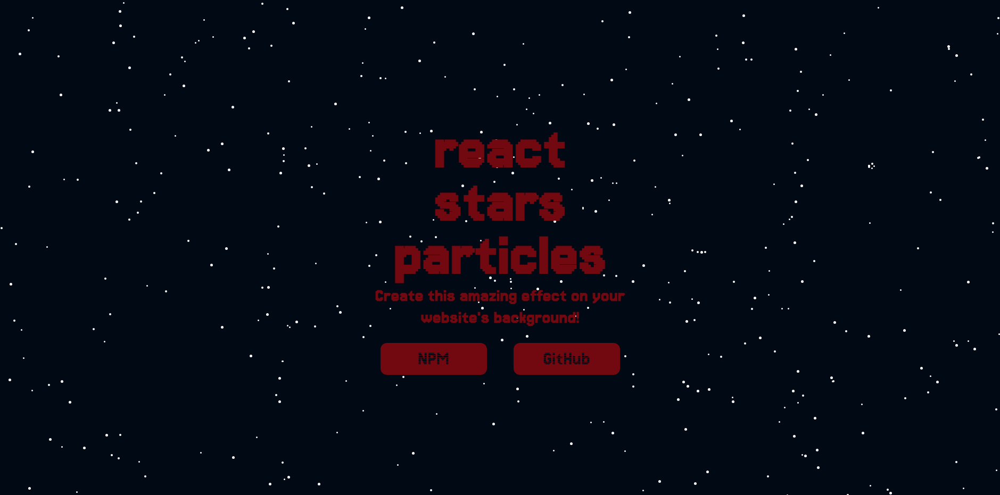

# galaxy-simulator



Welcome to the official showcase website for **react-stars-particles**! Dive into the mesmerizing galaxy background and explore the interactive features of our React component.

## Overview

**react-stars-particles** is a captivating React component that brings a dynamic and interactive galaxy background to your web pages. With stars that are attracted to the mouse pointer and smooth animations, it offers a unique and engaging user experience.

## Live Demo

Check out our live demo to see **react-stars-particles** in action:

[Live Demo](https://galaxysimulator.netlify.app)

## Features

- 🌌 Interactive galaxy background
- ⭐️ Stars attracted to mouse pointer
- 🚀 Smooth animations
- 🎨 Customizable star colors and speeds

## Installation

You can install **react-stars-particles** via npm or yarn:

```bash
npm install react-stars-particles
```

## Usage

Get started with **react-stars-particles** by adding it to your React project:

```jsx
import React from 'react';
import { Galaxy } from 'react-stars-particles';

function App() {
  return (
    <div>
      <h1>Welcome to My Galaxy</h1>
      <Galaxy />
    </div>
  );
}

export default App;
```

## Showcase

### Basic Usage

```jsx
<Galaxy />
```

### Customization

```jsx
<<Galaxy />
  quantity={200}
  color="#ffffff"
  attraction={0.5}
  repulse={0.2}
/>
```

## Documentation

For detailed documentation and a list of available props, visit:

[Documentation](https://github.com/hugofolloni/react-stars-particles)

